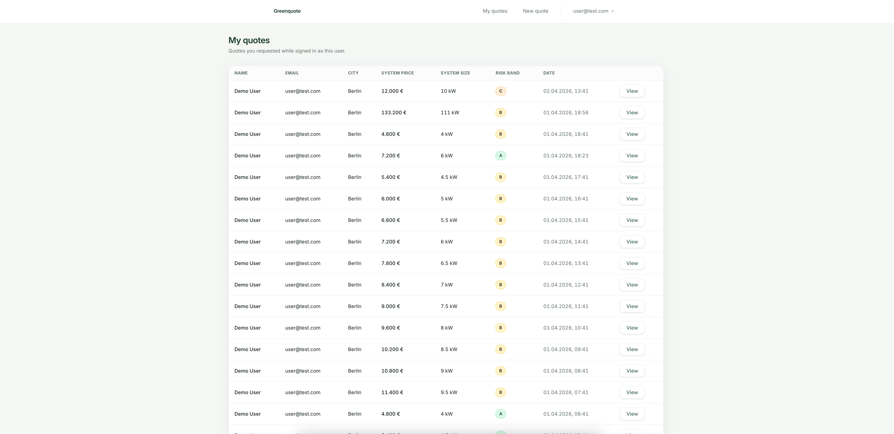
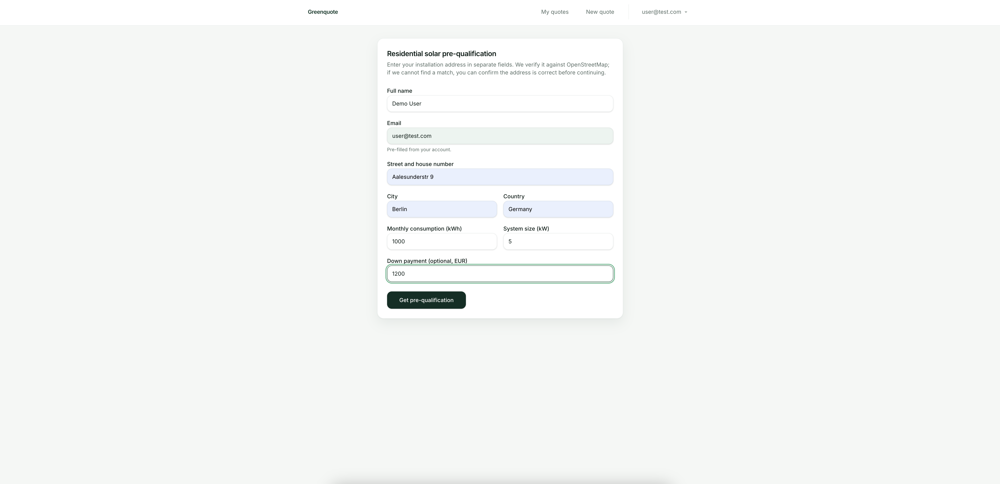
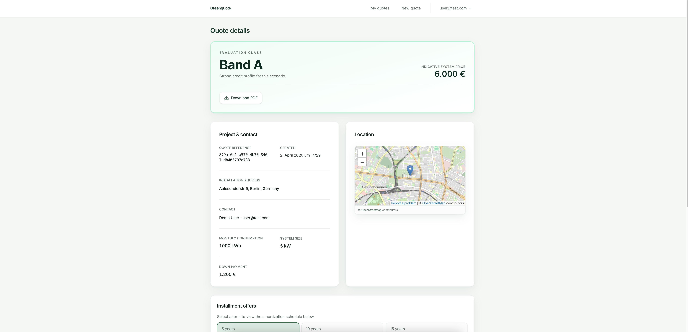
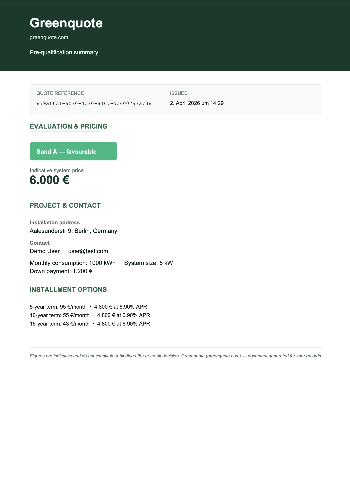
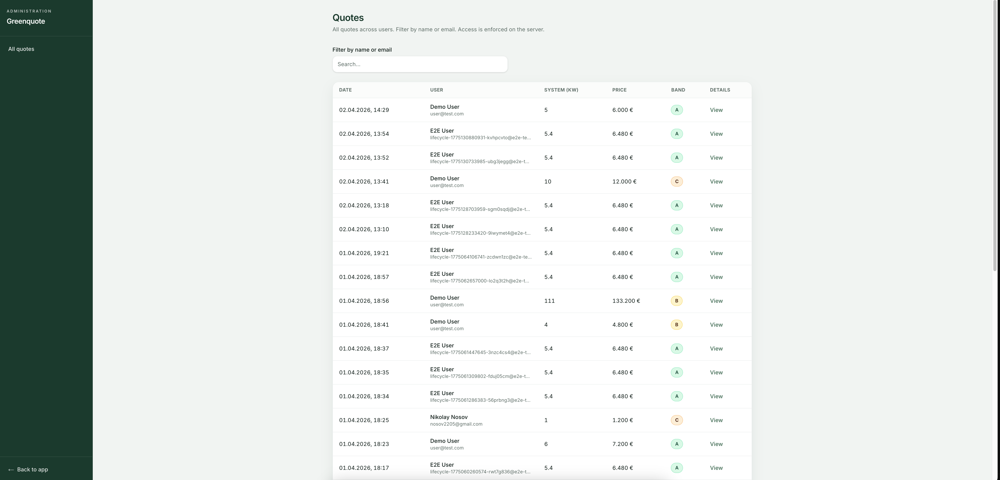

# Green Quote

A **solar panel quote and financing calculator** monorepo: users submit installation and consumption details, the API runs pricing and risk logic, and the UI shows terms, APR, payments, and amortization. An admin area lists and inspects quotes across customers.

## What’s in the repo

| Area | Role |
|------|------|
| **`frontend/`** | [Next.js](https://nextjs.org/) App Router UI, [Tailwind CSS](https://tailwindcss.com/), [React Hook Form](https://react-hook-form.com/) + [Zod](https://zod.dev/), [Auth.js](https://authjs.dev/) (NextAuth v5) for sessions |
| **`backend/`** | [NestJS](https://nestjs.com/) HTTP API, [Drizzle ORM](https://orm.drizzle.team/) + PostgreSQL, JWT auth, [Pino](https://getpino.io/) logging |
| **`packages/sdk/`** | Typed API client generated from `openapi/openapi.yaml` ([openapi-typescript](https://github.com/drwpow/openapi-typescript) + [openapi-fetch](https://github.com/drwpow/openapi-fetch)) |
| **`openapi/`** | OpenAPI spec shared by backend and SDK generation |
| **`packages/constants/`** | Shared constants (e.g. pricing) used by API and UI |

## Architecture

The app is a **classic SPA-style split**: a **Next.js** UI talks to a **NestJS** JSON API over HTTP. The **`openapi/openapi.yaml`** spec is the contract; **`@greenquote/sdk`** is generated from it so the frontend gets typed requests. **`@greenquote/constants`** keeps pricing numbers aligned between API and UI.

**Auth:** The browser signs in through Auth.js; credentials are forwarded to **`POST /api/auth/login`**, and Nest returns a **JWT** signed with the backend’s secret. Auth.js stores that token inside its **session** (signed with **`AUTH_SECRET`** on the Next side only). Server-side routes and actions read the session, attach **`Authorization: Bearer`**, and call the API; Nest validates JWTs with **`JWT_SECRET`** and never sees the Auth.js cookie.

**Data:** Quote and user data live in **PostgreSQL** via **Drizzle**. Pricing and amortization run in Nest services; quote results are persisted and surfaced to the list and detail views. **Admin** users hit the same API with role checks to search and inspect all quotes.

## UI screenshots

### Login


### Quote list



### Quote creation



### Quote details



### Quote summary doc



### Admin panel



## Prerequisites

- **Node.js** 25+ (see package engines if pinned elsewhere)
- **pnpm** 9+ (`corepack enable && corepack prepare pnpm@9.15.9 --activate` or install per [pnpm.io](https://pnpm.io/installation))
- **Docker** (for PostgreSQL via `backend/docker-compose.yml`; host port **5433** → container 5432 to avoid clashing with a local Postgres on 5432)

## Quick start

### 1. Install dependencies

```bash
pnpm install
```

### 2. Environment variables

**Backend** — copy and edit:

```bash
cp backend/.env.example backend/.env
```

Ensure `DATABASE_URL` matches Docker (`127.0.0.1:5433` by default) or your own Postgres.

**Frontend** — copy and set `AUTH_SECRET` and **`API_URL`** (required at build time by `next.config.ts`):

```bash
cp frontend/.env.example frontend/.env.local
# Or use `frontend/.env` — Next loads `.env*` from `frontend/`.
# Generate AUTH_SECRET: openssl rand -base64 32
```

Set `API_URL` to `http://localhost:3001/api` when using the local Nest API. Without `API_URL`, `pnpm run setup` will fail when building the frontend.

### 3. Local setup (Postgres, migrate, seed, builds)

From the **repository root**, run:

```bash
pnpm run setup
```

This script:

- Starts Postgres (`docker compose` in `backend/`)
- Builds `@greenquote/constants` (the seed script imports it; required on a fresh clone before `dist/` exists)
- Runs Drizzle migrations and the seed script (seed is additive / idempotent where noted—it does **not** truncate or drop the database)
- Regenerates and builds `@greenquote/sdk`
- Builds backend and frontend (compile check)

Use this after cloning or when you need migrations, seed data, and fresh workspace builds. To fully discard local Postgres data, stop the container and remove its Docker volume, then run setup again.

### 4. Production-style local stack (full setup + prod servers)

From the **repository root**, after `pnpm install` and env files (same as above):

```bash
pnpm run prod
```

This runs **`scripts/prod-stack.sh`**: starts Postgres, migrates, seeds, runs `build:all`, then starts the **Nest** process (`node dist/src/main.js`, no watch) and **Next.js** (`next start`, no React dev overlay). Defaults for `DATABASE_URL`, `JWT_SECRET`, `AUTH_SECRET`, and `API_URL` come from `scripts/common-env.sh` if you have not set `backend/.env` / `frontend/.env.local`.

### 5. Development servers

```bash
pnpm run dev
```

Starts:

- **API** on [http://localhost:3001](http://localhost:3001) (Nest watch; health check at `/api/health`)
- **Next.js** on [http://localhost:3000](http://localhost:3000) by default (set **`WEB_PORT`** to use another port)

`pnpm run dev` does **not** migrate or seed; run `pnpm run setup` first after clone (or when the schema or seed data is out of date).

**Frontend only** (API already running elsewhere):

```bash
pnpm run dev:web
```

## Useful scripts (root `package.json`)

| Script | Purpose |
|--------|---------|
| `pnpm run dev` | Postgres up + Nest `start:dev` + Next `dev` |
| `pnpm run prod` | Postgres up → migrate → seed → `build:all` → Nest + Next in **production** mode |
| `pnpm run setup` | Postgres up, migrate, seed, generate SDK, build all packages |
| `pnpm run generate:sdk` | Regenerate SDK types from `openapi/openapi.yaml` |
| `pnpm run build:all` | Build constants + SDK generate + build SDK + build backend + build frontend |

Backend-specific scripts (`cd backend`): `pnpm run db:up`, `pnpm run db:migrate`, `pnpm run db:seed`, `pnpm test`, `pnpm run test:e2e`.

## Tests

Automated tests live under **`backend/test/`** (Jest). The **frontend** has no automated test suite in this repo yet.

### Unit tests (`pnpm test` from `backend/`)

| Area | File | What is covered |
|------|------|-----------------|
| **Pricing** | `unit/modules/quotes/pricing.service.spec.ts` | System price (€/kW), principal after down payment, rounding; **risk bands A / B / C** boundary rules; **APR** per band; **5 / 10 / 15 year** offers with shared principal; **monthly payment** amortization (including 0% APR edge case). |
| **Quotes service** | `unit/modules/quotes/quotes.service.spec.ts` | **Create** rejects down payment ≥ system price; **findOne** owner vs non-owner vs **admin**; contact snapshot vs profile; **not found**; **listMine** summary amounts; **getAmortizationSchedule** valid/invalid term, owner vs forbidden. |
| **Quote JSON storage** | `unit/common/types/quote-result-storage.spec.ts` | Serialize / deserialize **EUR ↔ integer cents**; optional address; round-trip invariants. |
| **Money helpers** | `unit/common/utils/money.spec.ts` | `eurToCents` / `centsToEur` rounding, float safety, round-trips. |
| **Amortization** | `unit/common/utils/amortization.spec.ts` | Schedule sums to principal, balance ends at zero; empty edge cases; 0% APR. |
| **Address** | `unit/common/utils/address.spec.ts` | **extractCityFromAddress** — trailing country codes / country names, PLZ stripping. |

### API e2e tests (`pnpm run test:e2e` from `backend/`)

Requires **Postgres** (e.g. `pnpm run db:up` + migrate; or run after **`pnpm run setup`** from the repo root). The app is booted in-process with **`supertest`** against a real database.

| File | What is covered |
|------|-----------------|
| `e2e/app.e2e-spec.ts` | **`GET /api/health`** returns `{ status: 'ok' }`. |
| `e2e/quote-lifecycle.e2e-spec.ts` | **Happy path:** register → login → **create quote** → **list quotes** → **get quote by id** → **amortization** for a term. |
| `e2e/api-errors.e2e-spec.ts` | **Auth / validation / domain errors:** short password, bad email, **duplicate email (409)**, wrong password **(401)**, missing **Bearer** on quotes **(401)**, invalid create-quote body, down payment vs system price **(400)**, unknown quote **(404)**, invalid UUID **(400)**, **forbidNonWhitelisted** extra JSON fields **(400)**. |

Global HTTP errors are shaped by **`GlobalExceptionFilter`** (included in the e2e test app).

## Production readiness

The app is suitable for local development and demos. To run it **in production**, plan for at least the following.

### Packaging & dependencies

- **Published packages:** Today **`@greenquote/constants`** and **`@greenquote/sdk`** are consumed via **`workspace:*`** and built with the repo (`pnpm run build:all`). For production **publish semver’d packages** to a registry (npm org or private registry) and depend on versions instead of building workspace packages inside every deploy. Clearer supply chain and faster CI when only app code changes.

### Containers & runtime

- **Docker for services:** Ship **production Dockerfiles** for the **Nest API** and **Next.js** app, plus **compose/Kubernetes manifests** or equivalent. The repo today only uses Docker for **local Postgres**; production should target **managed PostgreSQL** and wire health checks to **`/api/health`**.

### Data & search

- **Admin quote search:** The admin list uses **`ILIKE`** on name/email. For production scale and relevance, this should be replaced with **PostgreSQL full-text search** or a dedicated search index/service.

### Security & auth

- **JWT lifecycle:** Current access tokens are long-lived by configuration. Production should add **refresh tokens**, **rotation**, and a **revocation** story.

### CI/CD

- **Pipeline:** For production, add a **CI/CD pipeline**: **install**, **lint**, **unit tests**, **`build:all`**, **API e2e** with a **Postgres service container**, then deploy to staging/production.

### Operations & quality

- **Secrets:** Load from a **secret manager** in the cloud;
- **API edge:** **Rate limiting**, strict **CORS** for known web origins, request size limits.
- **Database:** Automated **backups**, migration rollback strategy, **connection pooling**.
- **Data isolation** for multi-tenant systems: use **PostgreSQL row-level security (RLS)** or equivalent so one tenant cannot read or modify or get another tenant’s data.
- **Observability:** **Metrics** and **tracing** with **alerting** on errors and latency; correlate request IDs across Next route handlers and Nest.
- **Testing:** **Playwright** for critical UI flows;

**Local defaults:** web [http://localhost:3000](http://localhost:3000), API [http://localhost:3001](http://localhost:3001) — see [Quick start](#quick-start).
